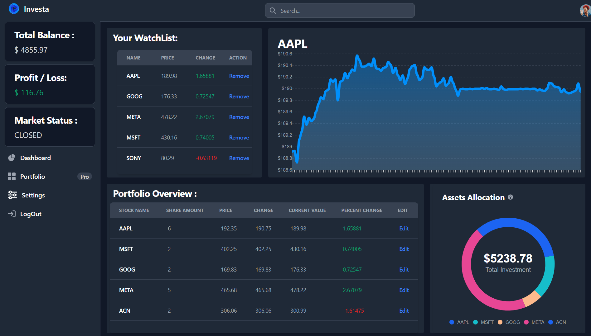
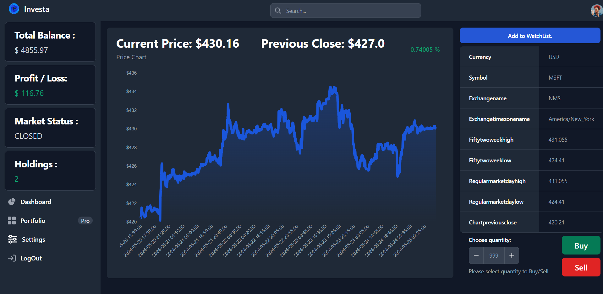

# Stock Market Simulator
Stock Market Simulator buy or sell stocks with real time data with an intreactive and customizable user dashboard.

Welcome to Stalk-the-Stock! 🌟 Here's how to get started: 
This is a stock market simulator
<!--
* **Create Your Account:** Sign up to start 
* **Demo Money:** Once registered, you'll receive $10,000 in virtual money to begin trading.
* **Buying Stocks:** Use your demo money to buy stocks. Simply search for the stocks you're interested in, and purchase them directly from your personalized dashboard.
* **Real-Time Updates:** Stock prices update in real-time using the Yahoo Finance API, so you always have the latest market data at your fingertips.
* **Track Your Portfolio:** Monitor your assets and watch their performance over time. Your interactive dashboard makes it easy to see how your investments are doing and make informed decisions.

## Dashboard
Dashboard displays a watchlist with an interactive graph, a portfolio overview of the holding stocks, and the total stock allocation. 
Your dashboard is your personal trading hub! Here's what it shows:

* **Total Balance:** See the total value of your account, investments.
* **Profit/Loss:** Track your overall gains or losses in real-time.
* **Market Status:** Know whether the market is closed, regular, pre-market, or post-market.
* **Watchlist:** Keep an eye on the stocks you're interested in.
* **Watchlist Graphs:** Visualize the performance of stocks on your watchlist.
* **Portfolio Overview:** Get a detailed summary of all your investments.
* **Asset Allocations:** See how your investments are distributed across different assets.

## Details (Buy/Sell) Page
This page allows users to monitor graphs and live stock prices, as well as buy and trade virtual stocks.
The search page is your go-to for detailed stock information and trading. Here's what you can do:

* **View Stock Details:** See the current price, previous close, and detailed stats like 52-week high/low, market day high/low.
* **Real-Time Price Chart:** Track the stock's performance with an up-to-date price chart.
* **Market Status:** Know whether the market is closed or open.
* **Buy/Sell Stocks:** If you hold stocks, you can easily buy or sell directly from this page.
* **Watchlist:** Add stocks to your watchlist for future tracking.

 -->

---

## 🚀 Features

- 💰 **Virtual Trading** with $10,000 demo balance
- 🔍 **Real-time stock data** powered by [Yahoo Finance API](https://finance.yahoo.com/)
- 📊 **Live Price Charts** for each stock in your watchlist
- 📂 **Portfolio Management** with auto-calculated P&L
- 🧾 **Watchlist Support** to track favorite stocks
- 📅 **Market Status Indicator** (Closed, Open, Pre/Post Market)
- 🎯 **Asset Allocation Graphs** to see how your investments are spread
- 🔐 **User Authentication** and personalized experience
- 🖥️ **Fully Responsive Dashboard**

---

## 🖼️ Screenshots

<Insert images here showing dashboard, buy/sell page, portfolio overview, and watchlist chart>

---

## 🛠️ Tech Stack

- **Frontend**: HTML, CSS (Tailwind), JavaScript
- **Backend**: Python, Django
- **Database**: SQLite (default Django)
- **APIs**: Yahoo Finance unofficial API
- **Charts**: ApexCharts.js

---

## 🎯 How to Use (User Guide)

### 🔐 Create Your Account
- Sign up to get started.
- A demo balance of **$10,000** is added automatically to your virtual wallet.

### 💸 Buy & Sell Stocks
- Search stocks using the live search bar.
- View stock details with:
  - Current price
  - Day high/low
  - 52-week range
- Use the "Buy/Sell" form to place trades.

### 📋 Track Your Portfolio
- Access your dashboard:
  - **Total Balance**: Real-time net worth.
  - **Profit/Loss**: Current P/L across all holdings.
  - **Watchlist**: List of all your tracked stocks.
  - **Watchlist Graphs**: Interactive graph of selected watchlist stocks.
  - **Portfolio Summary**: Shows holdings and performance.
  - **Asset Allocation**: Pie chart of portfolio distribution.

### 📈 Real-Time Graphs
- Interactive chart on the dashboard and stock details page.
- Automatically updates prices every few seconds.

---

## 📌 Pages Overview

### 🏠 Home Page
Landing page with app introduction and sign-up/login access.

### 📊 Dashboard
Dashboard displays a watchlist with an interactive graph, a portfolio overview of the holding stocks, and the total stock allocation. 
Your dashboard is your personal trading hub! Here's what it shows:
* **Total Balance:** See the total value of your account, investments.
* **Profit/Loss:** Track your overall gains or losses in real-time.
* **Market Status:** Know whether the market is closed, regular, pre-market, or post-market.
* **Watchlist:** Keep an eye on the stocks you're interested in.
* **Watchlist Graphs:** Visualize the performance of stocks on your watchlist.
* **Portfolio Overview:** Get a detailed summary of all your investments.
* **Asset Allocations:** See how your investments are distributed across different assets.

### 💼 Details Page (Buy/Sell)
This page allows users to monitor graphs and live stock prices, as well as buy and trade virtual stocks.
The search page is your go-to for detailed stock information and trading. Here's what you can do:
* **View Stock Details:** See the current price, previous close, and detailed stats like 52-week high/low, market day high/low.
* **Real-Time Price Chart:** Track the stock's performance with an up-to-date price chart.
* **Market Status:** Know whether the market is closed or open.
* **Buy/Sell Stocks:** If you hold stocks, you can easily buy or sell directly from this page.
* **Watchlist:** Add stocks to your watchlist for future tracking.

---

## Author
Made with ❤️ by [Shruti Kotkar](https://github.com/Shrutikotkar-23)